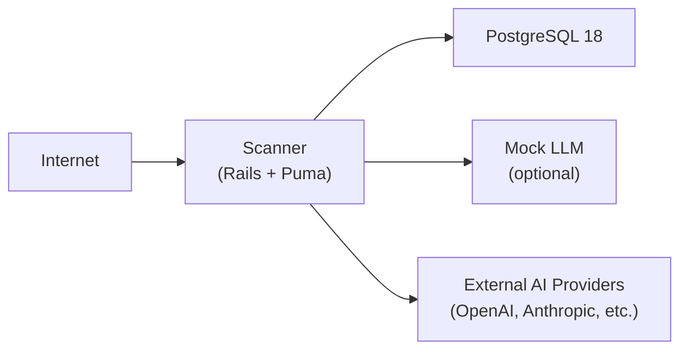

# Production Deployment with Docker Compose

This guide covers deploying Scanner in production using Docker Compose.

## Architecture

A production Scanner deployment consists of three containers:



All three containers run on the same host. For high-availability or scaling, see your container orchestration platform's documentation.

## Quick Deployment

```bash
# Download the compose file and environment template
curl -O https://raw.githubusercontent.com/0din-ai/ai-scanner/main/dist/docker-compose.yml
curl -O https://raw.githubusercontent.com/0din-ai/ai-scanner/main/.env.example
cp .env.example .env

# Edit .env (required values)
# SECRET_KEY_BASE=$(openssl rand -hex 64)
# POSTGRES_PASSWORD=your_strong_password

docker compose up -d
```

## Environment Configuration

### Minimum Required

```bash title=".env"
SECRET_KEY_BASE=<64-byte hex string from `openssl rand -hex 64`>
POSTGRES_PASSWORD=<strong password>
```

### Production Recommended

```bash title=".env"
SECRET_KEY_BASE=<generated>
POSTGRES_PASSWORD=<generated>

# If behind a TLS-terminating proxy (nginx, Caddy, etc.)
ASSUME_SSL=true

# Change the port if 80 is taken
PORT=80

# Tune retention
RETENTION_DAYS=90

# Set a custom admin account before first boot
ADMIN_EMAIL=security@yourcompany.com
ADMIN_INITIAL_PASSWORD=<strong password>
```

## Updating Scanner

Pull the latest image and restart:

```bash
docker compose pull scanner
docker compose up -d
```

Then run any pending database migrations:

```bash
docker compose exec scanner rails db:migrate
```

See [Upgrading](./upgrading) for more detail on safe upgrade procedures.

## Data Persistence

PostgreSQL data is stored in a Docker named volume (`postgres_data`). This volume persists across `docker compose down` and container restarts.

:::warning docker compose down --volumes
Running `docker compose down --volumes` (or `-v`) will **delete all your data**, including all scan reports, targets, and user accounts. Only use this flag if you intentionally want to reset to a clean state.
:::

## Running Database Migrations Manually

After pulling updates:

```bash
docker compose exec scanner rails db:migrate
```

## Accessing the Rails Console

For debugging or administrative tasks:

```bash
docker compose exec scanner rails console
```

## Viewing Logs

```bash
# Follow all logs
docker compose logs -f

# Scanner only
docker compose logs -f scanner

# Last 100 lines
docker compose logs --tail=100 scanner
```

## Stopping Scanner

```bash
# Stop containers (preserves data)
docker compose down

# Stop and remove volumes (DELETES DATA)
docker compose down --volumes
```

## TLS / HTTPS

Scanner does not terminate TLS itself — it runs plain HTTP internally and relies on a reverse proxy for TLS. See [Reverse Proxy Setup](./reverse-proxy) for nginx and Caddy examples.

## Resource Requirements

| Resource | Minimum | Recommended |
|---|---|---|
| RAM | 2 GiB | 4 GiB |
| Disk | 10 GiB | 20 GiB |
| CPU | 2 cores | 4 cores |

CPU usage spikes during active scans due to garak execution. The `PARALLEL_ATTEMPTS` setting controls concurrency.
