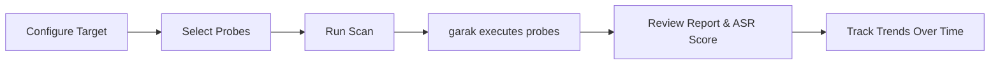

# Scanner

**An open-source AI model security assessment platform**, built on [Ruby on Rails](https://rubyonrails.org/) and [NVIDIA garak](https://github.com/NVIDIA/garak). Scanner helps organizations test their AI systems for vulnerabilities before deployment — similar to penetration testing for traditional software.

## What is Scanner?

AI models are increasingly deployed in production systems, but standard security practices don't yet cover model-level vulnerabilities. Scanner provides a structured workflow for identifying common weaknesses — prompt injection, jailbreaks, data leakage, harmful content generation, and more — using a library of standardized probes aligned to the [OWASP LLM Top 10](https://owasp.org/www-project-top-10-for-large-language-model-applications/).

## Key Features

| Feature | Description |
|---|---|
| **179 community probes** | Across 35 vulnerability families, from garak's community probe library |
| **Multi-target scanning** | Test API-based LLMs and browser-based chat UIs |
| **Scheduled & on-demand scans** | Configurable recurrence, run on your timeline |
| **Attack Success Rate (ASR)** | Consistent scoring with trend tracking across runs |
| **PDF report export** | Per-probe, per-attempt drill-down |
| **SIEM integration** | Forward results to Splunk or Rsyslog |
| **Multi-tenant** | Multiple organizations on a single deployment, data encrypted at rest |
| **No artificial limits** | All features unlocked, unlimited scans and users |

## Supported AI Providers

Scanner connects to AI models via [garak generators](https://github.com/NVIDIA/garak). Supported provider families include:

| Provider | Type |
|---|---|
| OpenAI | API |
| Azure OpenAI | API |
| Ollama (local) | API |
| Hugging Face | API |
| AWS Bedrock | API |
| Groq | API |
| Cohere | API |
| Replicate | API |
| OpenRouter | API |
| LiteLLM (Anthropic, Google, etc.) | API |
| NVIDIA NIM / NVCF | API |
| Mistral | API |
| REST (any HTTP endpoint) | API |
| Any web-based chat UI | Webchat |

API keys are managed per-target in the Scanner UI — no need to set global environment variables.

## How It Works

1. **Configure** — Add an AI target (API endpoint or web UI)
2. **Select** — Choose probe families to test
3. **Scan** — Scanner invokes garak against your target
4. **Review** — View Attack Success Rate scores and per-attempt results
5. **Track** — Compare ASR trends across scan runs over time

## Get Started

  

### New to Scanner?
Start with the [Quick Start guide](./getting-started/quick-start) — up and running in minutes with Docker.

  

  

### Contributing?
See the [Development Setup](./development/setup) guide and [Contributing conventions](./development/conventions).

  

---

## Architecture Overview

Scanner is a Rails 8 application with an extensible engine architecture. Organizations can layer custom functionality without forking the core:

- **[`Scanner.configure`](./development/extension-points#scannerconfigure)** — swap probe access, retention strategy, auth providers, and lifecycle hooks
- **[`BrandConfig.configure`](./development/extension-points#brandconfigconfigure)** — customize brand name, logo, fonts, and powered-by text
- **[`ProbeSourceRegistry`](./development/extension-points#probesourceregistry)** — register additional probe data sources for automatic sync

See the [Architecture](./development/architecture) page for a full component diagram.
