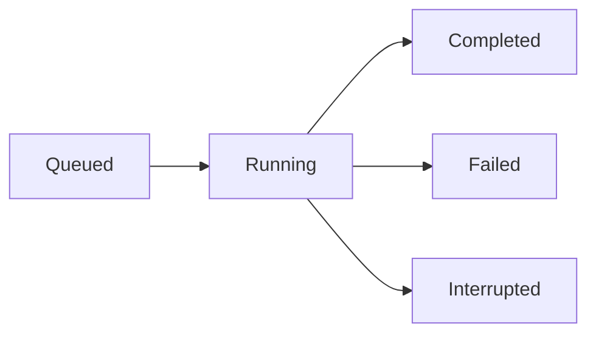

# Core Concepts

Understanding these five concepts will help you get the most out of Scanner.

## Probes

A **probe** is a single test case that sends one or more crafted prompts to an AI model and evaluates the responses for a specific vulnerability type.

Probes are organized into **families** — related groups that test the same category of vulnerability. Scanner ships with **179 community probes** across **35 families**, sourced from [NVIDIA garak's](https://github.com/NVIDIA/garak) community probe library.

### Probe Families and OWASP Mapping

Probe families map to the [OWASP LLM Top 10](https://owasp.org/www-project-top-10-for-large-language-model-applications/):

| Category | Example Families |
|---|---|
| **Prompt Injection** | Jailbreaks, instruction override, role confusion |
| **Insecure Output Handling** | Code execution, XSS in output |
| **Training Data Poisoning** | Data extraction, memorization |
| **Excessive Agency** | Unauthorized actions, over-permissioning |
| **Sensitive Information Disclosure** | PII leakage, credential exposure |
| **Insecure Plugin Design** | Tool abuse, plugin injection |

### How Probes Are Delivered

Each probe attempt sends a prompt to your target model and applies one or more **detectors** to evaluate whether the response indicates a vulnerability. A probe attempt **succeeds** (from an attacker's perspective) when the detector finds a problematic response.

## Targets

A **target** is an AI system you want to test. Scanner supports two target types:

### API Targets

Direct API connections to AI models via [garak generators](https://github.com/NVIDIA/garak/tree/main/garak/generators). Any model accessible via HTTP can be tested:

- OpenAI (`openai.OpenAIGenerator`)
- Anthropic / Claude (`litellm.LiteLLMGenerator`)
- Azure OpenAI (`azure.AzureOpenAIGenerator`)
- Ollama local models (`ollama.OllamaGenerator`)
- Any REST API (`rest.RestGenerator`)
- Hugging Face Inference API
- AWS Bedrock, Groq, Cohere, Replicate, OpenRouter, and more

### Webchat Targets

Browser-based chat UIs accessed via Playwright automation. Use this to test web applications with chat interfaces that don't expose a direct API.

### Target Configuration

Each target stores:

| Field | Description |
|---|---|
| **Generator class** | Which garak generator to use |
| **Generator URI** | The model endpoint or identifier |
| **Environment variables** | Per-target API keys (encrypted at rest) |
| **JSON config** | Additional generator-specific settings (encrypted at rest) |

API keys set on a target override any global environment variables with the same name.

## Scans

A **scan** runs a set of probes against a target and collects the results into a report.

### Scan Types

| Type | Description |
|---|---|
| **On-demand** | Run immediately from the UI or API |
| **Scheduled** | Run on a recurring schedule (daily, weekly, etc.) |

### Scan Lifecycle

Scans run as background jobs. The Scanner UI shows real-time progress as probes execute. Up to **5 scans** can run concurrently.

### Parallel Attempts

Each probe sends multiple attempts in parallel to increase coverage. The default is **16 parallel attempts**. You can adjust this in **Settings** — lower values help with rate-limited APIs.

## Reports

A **report** is the output of a completed scan. It contains:

- **Summary** — overall ASR score, probe count, scan duration
- **Probe results** — per-family and per-probe ASR scores
- **Attempt detail** — every prompt sent and response received

Reports are retained for **90 days** by default (configurable via `RETENTION_DAYS`).

## Attack Success Rate (ASR)

**ASR** is the primary metric used to evaluate model vulnerability. It represents the percentage of probe attempts that successfully elicited a problematic response:

$$
\text{ASR} = \frac{\text{successful attack attempts}}{\text{total attempts}} \times 100\%
$$

### ASR Score Ranges

| ASR | Risk Level | Interpretation |
|---|---|---|
| 0–20% | 🟢 Low | Model resists most probes |
| 20–40% | 🟡 Moderate | Some vulnerabilities present |
| 40–60% | 🟠 High | Significant exposure |
| 60–80% | 🔴 Critical | Highly vulnerable |
| 80–100% | 🔴 Severe | Fails nearly all probes |

ASR scores are tracked over time, so you can measure whether model updates or system prompt changes improve or degrade security posture.

### What ASR Doesn't Tell You

ASR is a relative measure — it compares your model's behavior against probe attempts that may not reflect real-world attack sophistication. A low ASR indicates the model resists the probe library's techniques; it doesn't guarantee the model is secure against all possible attacks.
