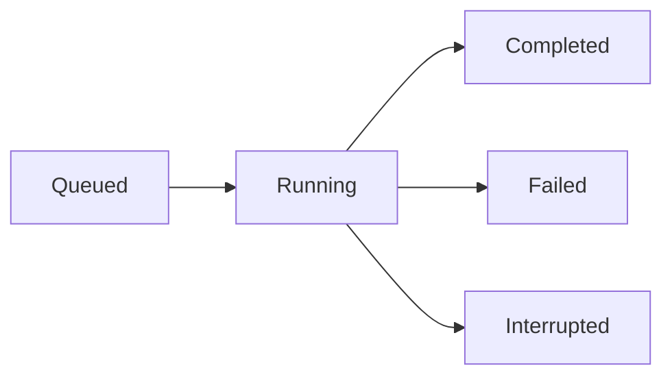

# Scanning

## Running a Scan

1. Navigate to **Scans** in the sidebar
2. Click **New Scan**
3. Configure:
   - **Name** — a descriptive name for this scan run
   - **Target** — which AI model to scan
   - **Probes** — select probe families to include (or select all)
   - **Output Server** — optional SIEM destination for results
4. Click **Run Scan**

The scan is queued immediately and begins when a worker slot is available. Scanner runs up to **5 scans concurrently**.

## Scheduling Scans

Scheduled scans run automatically on a recurring basis without manual intervention.

1. From the scan configuration, enable **Schedule**
2. Choose recurrence: daily, weekly, or a custom cron expression
3. Save — Scanner will run the scan automatically at the configured interval

Scheduled scans use the same probe selection and target configuration as one-off scans. Results are saved as new reports each run, allowing you to track ASR trends over time.

## Monitoring Progress

While a scan runs, the progress view shows:

- Which probe family is currently executing
- Number of attempts completed / total
- Real-time ASR as results come in

You can navigate away — the scan continues in the background. Return to the scan page to check status.

## Parallel Attempts

Each probe runs multiple attempts in parallel to improve coverage. The default is **16 parallel attempts**.

Adjust this in **Settings → Parallel Attempts** based on your target's rate limits:

| Provider | Recommended Setting |
|---|---|
| OpenAI | 5–10 |
| Anthropic | 3–5 |
| Local models (Ollama) | 20–50 |
| Rate-limited APIs | 2–5 |

:::tip
If scans are failing with rate limit errors, reduce parallel attempts for that target by setting `PARALLEL_ATTEMPTS` as a per-target environment variable.
:::

## Scan Lifecycle

- **Queued** — waiting for a worker slot
- **Running** — probes are executing
- **Completed** — all probes finished, report is available
- **Failed** — garak encountered an error; check the scan log for details
- **Interrupted** — Scanner was restarted mid-scan; the scan will be retried automatically

## Stopping a Scan

Running scans cannot be stopped mid-execution in the current release. If you need to cancel a scan, restart the Docker container — the scan will be marked as interrupted and retried.

## Report Retention

Completed reports are retained for **90 days** by default. Adjust this with the `RETENTION_DAYS` environment variable in your `.env` file. Reports older than the retention period are automatically deleted by a background job.
